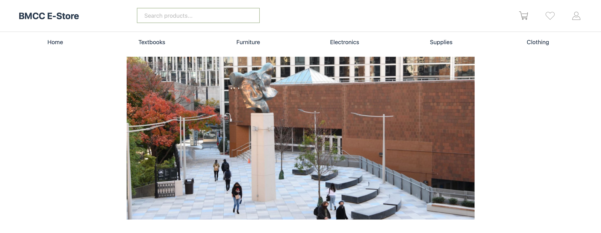

# BMCC E-Store



The BMCC E-Store is a comprehensive desktop application built using C++ and Qt framework, providing BMCC students with a platform to buy and sell academic materials. The application implements secure user authentication, personalized recommendations, and efficient cart management.


## Features

- **Secure Authentication**: Email domain validation for BMCC students, SHA-256 password hashing, and session management
- **Personalized Recommendations**: Algorithm that analyzes a student's major and course requirements
- **Real-time Cart Management**: Tracks item quantities, availability, and pricing
- **User-friendly Interface**: Responsive design with intuitive navigation
- **Product Categories**: Textbooks, furniture, electronics, supplies, and clothing

## Technologies Used

- **C++**: Core programming language
- **Qt Framework**: 
  - QtWidgets for UI elements
  - QtSql for database integration
  - QtCore for memory management and event handling
- **CMake**: Build system configuration
- **SQLite**: Database for storing user data and product listings
- **SHA-256**: Secure password hashing algorithm

## Installation

### Prerequisites

Before building the BMCC E-Store, ensure you have the following installed:

- C++ Compiler (GCC, Clang, or MSVC)
- CMake (version 3.16 or higher)
- Qt 6 components:
  - Qt Core
  - Qt Widgets
  - Qt SQL

### Build Instructions

#### On macOS/Linux:

```bash
# Clone the repository
git clone https://github.com/DarlynGomez/honors_project.git
cd honors_project

# Create build directory and navigate to it
mkdir build
cd build

# Generate build files with CMake
cmake ..

# Build the project
make

# Run the application
./honors_project
```

#### On Windows:

```cmd
# Clone the repository
git clone https://github.com/DarlynGomez/honors_project.git
cd honors_project

# Create build directory and navigate to it
mkdir build
cd build

# Generate build files with CMake
cmake ..

# Build the project
cmake --build .

# Run the application
.\Debug\honors_project.exe
```

## Future Directions

Planned enhancements include:

- **Push notifications** for real-time updates and user interaction
- **Payment integration** for secure checkouts
- **AI recommendations** for improved product suggestions
